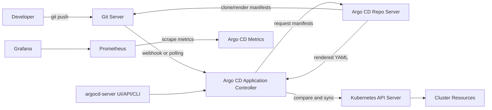

# GitOps End-to-End Flow Diagram


```mermaid
flowchart LR
    Dev[Developer] -->|git push| Git[Git Server]
    Git -->|webhook or polling| Controller[Argo CD Application Controller]
    Server[argocd-server UI/API/CLI] --> Controller
    Controller -->|request manifests| Repo[Argo CD Repo Server]
    Repo -->|clone/render manifests| Git
    Repo -->|rendered YAML| Controller
    Controller -->|compare and sync| KubeAPI[Kubernetes API Server]
    KubeAPI --> Cluster[Cluster Resources]
    Prom[Prometheus] -->|scrape metrics| ArgoMetrics[Argo CD Metrics]
    Grafana[Grafana] --> Prom
```
```
